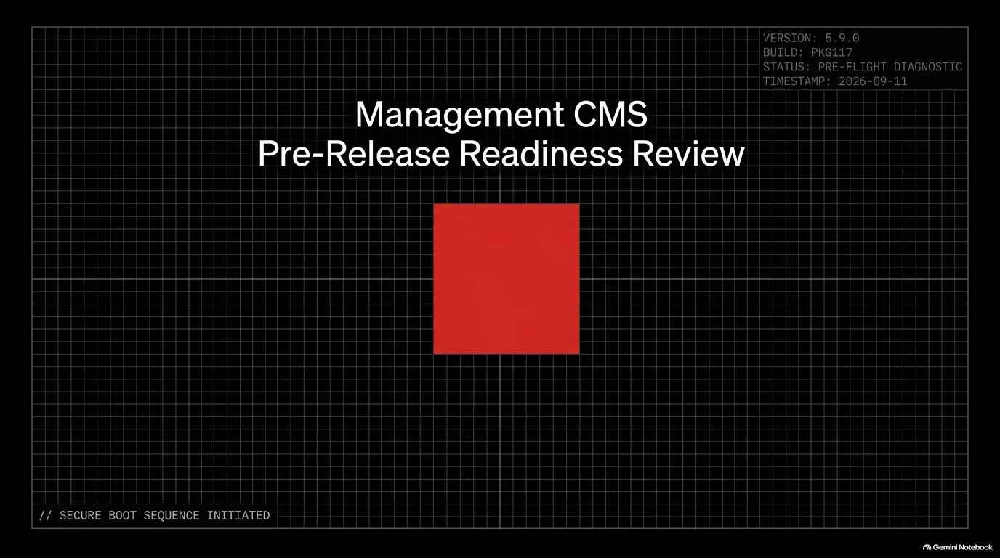
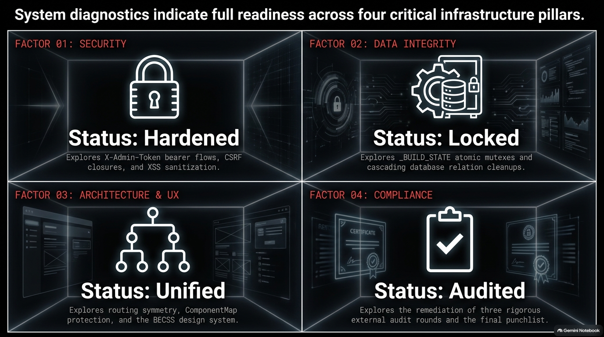
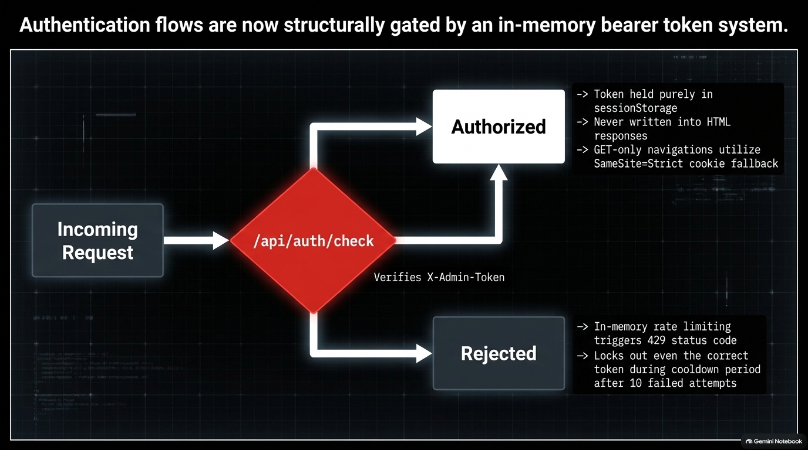
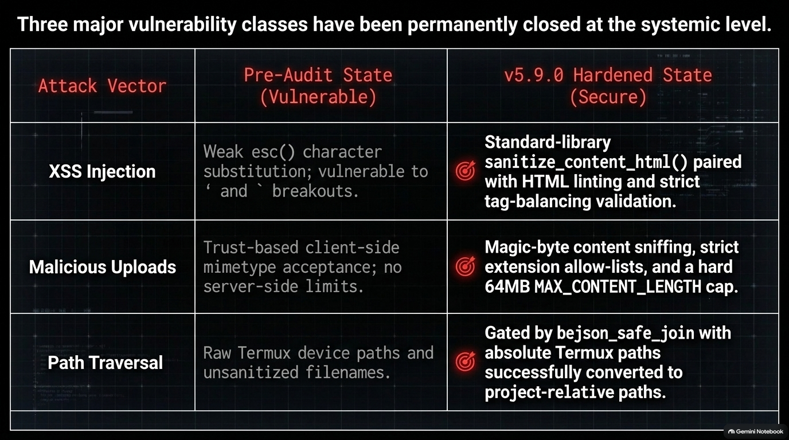
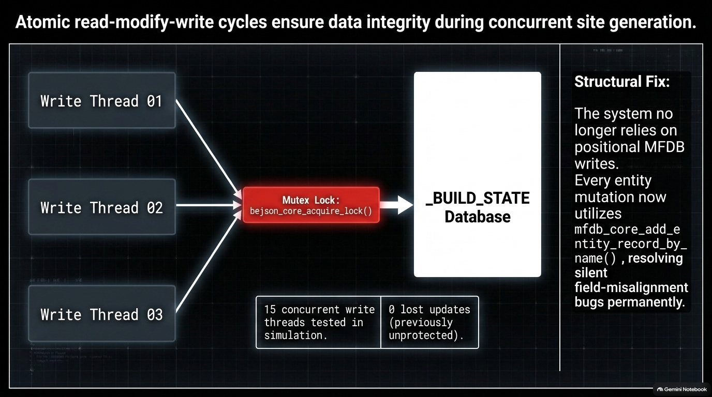
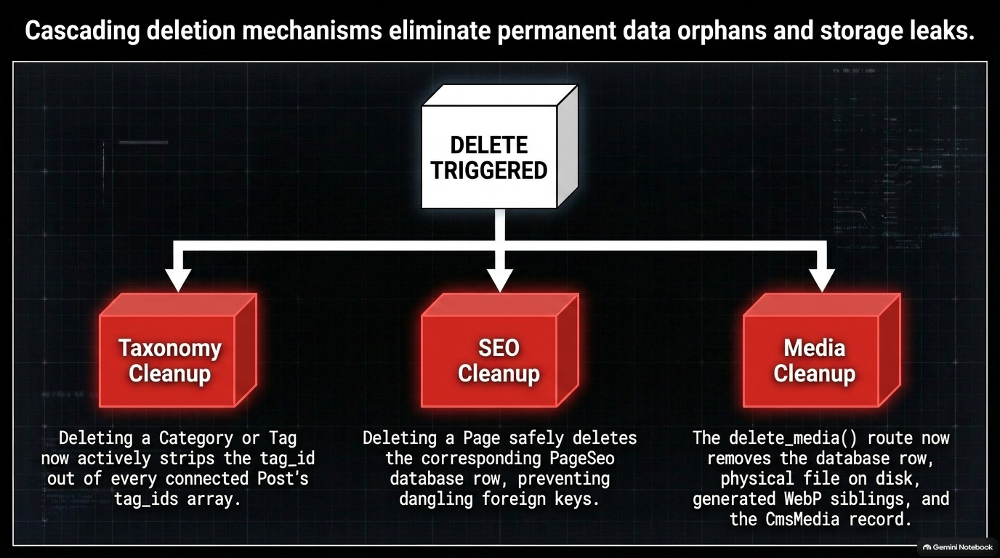
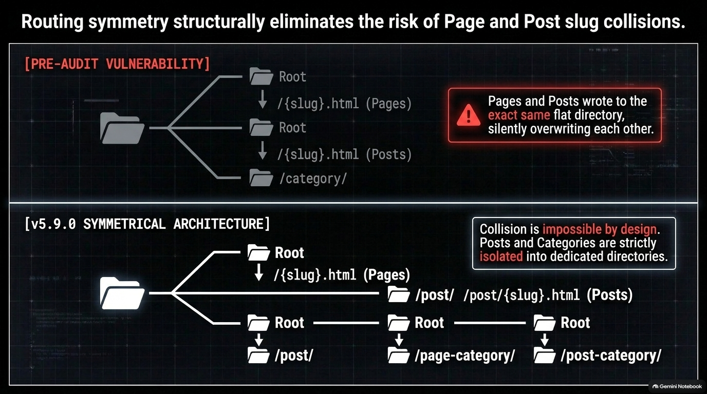
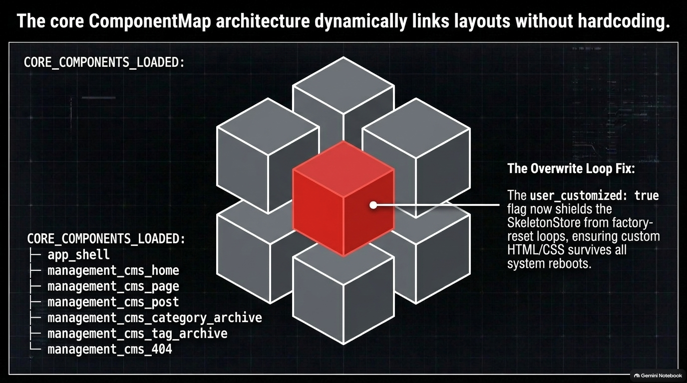
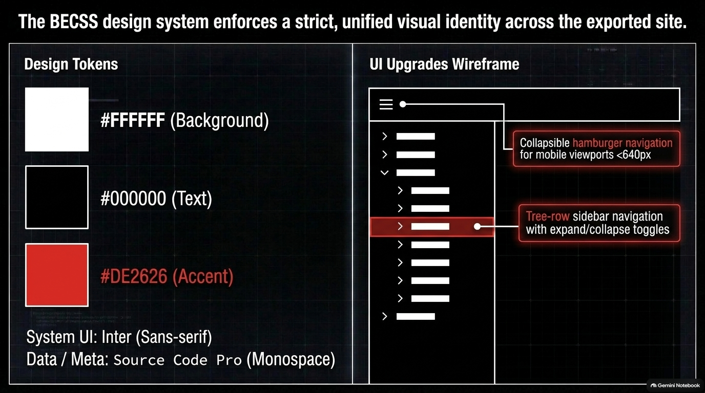
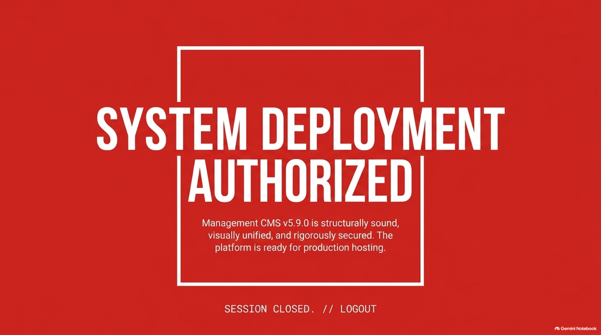

# Management_CMS

[](https://github.com/boehnenelton/Management_CMS)
[](https://github.com/boehnenelton/Management_CMS)
[](LICENSE)
[](https://www.python.org/)




> **Comprehensive Flask & BEJSON-MFDB Administrative Management CMS and Static-Site Export Engine.**

---

## 📋 Table of Contents
- [What Is It?](#-what-is-it)
- [Introduction](#-introduction)
- [Beginner's Usage Guide](#-beginners-usage-guide)
  - [Prerequisites](#prerequisites)
  - [Step-by-Step Installation](#step-by-step-installation)
  - [Launching the Administrative Server](#launching-the-administrative-server)
  - [Navigating the Management Console](#navigating-the-management-console)
  - [Creating Content and Managing Media](#creating-content-and-managing-media)
  - [Generating and Deploying Static Sites](#generating-and-deploying-static-sites)
- [Technical Features](#-technical-features)
  - [BEJSON 104a & MFDB Architecture](#bejson-104a--mfdb-architecture)
  - [Field Map Cache Enforcement](#field-map-cache-enforcement)
  - [Core Content Modules](#core-content-modules)
  - [Static Site Generation Pipeline](#static-site-generation-pipeline)
  - [Media Pipeline & WebP Auto-Conversion](#media-pipeline--webp-auto-conversion)
  - [Security Architecture & System Hardening](#security-architecture--system-hardening)
  - [REST API Reference & Route Matrix](#rest-api-reference--route-matrix)
- [Finalization Summary](#-finalization-summary)
- [License & Author Credits](#-license--author-credits)

---

## ❓ What Is It?

**Management_CMS** is a lightweight, high-performance, single-administrator content management system and static site generator built on top of Python 3.10+, Flask, and the **BEJSON 104a / MFDB (Multi-File Database)** tabular data specification.

Unlike traditional CMS platforms that rely on heavy relational SQL database engines (such as MySQL or PostgreSQL) or proprietary binary formats, Management_CMS stores all application state, pages, blog posts, links, notes, tasks, categories, and media metadata in human-readable, schema-validated BEJSON 104a flat files. 




Management_CMS provides a dual-mode workflow:
1. **Dynamic Administrative Console**: An interactive, single-page web interface operating at local port `5030` for managing all content, links, notes, tasks, media, and site settings with real-time feedback.
2. **Static Site Build Pipeline**: An automated compilation engine that transforms the entire BEJSON database into pre-rendered, hyper-optimized static HTML, CSS, and asset files inside the `Export/` directory—ready for zero-cost deployment to public hosting platforms like GitHub Pages, Cloudflare Pages, Netlify, or Vercel.

Designed with a sleek, high-contrast administrative design system (Black `#000000`, White `#FFFFFF`, and Accent Red `#DE2626`), Management_CMS delivers ultra-fast page execution, zero database server overhead, complete data portability, and robust security guarantees.

### Primary Architectural Advantages
- **Zero Third-Party Database Dependencies**: No need to configure or manage database daemons.
- **Human-Readable Data Inspection**: Every database record is plain JSON organized by tabular schemas.
- **Deterministic Static Rendering**: Compiles dynamic database state into static HTML artifacts.
- **Integrated Productivity Suite**: Combines internal bookmarking, notes, and tasks with public publishing.

---

## 🚀 Introduction

Modern content publishing often forces developers to choose between complex, resource-heavy monolithic CMS platforms or minimal static site generators that lack intuitive admin interfaces. **Management_CMS** bridges this gap by offering a fully self-contained local administrative backend paired with a deterministic static exporter.

### Core Objectives
- **Data Autonomy & Portability**: Eliminates database lock-in. Every record exists in clean BEJSON files that can be edited, audited, backed up, or version-controlled directly.
- **Zero-Latency Persistence**: Implements O(1) field-map index caching (`bejson_core_get_field_map()`), ensuring lightning-fast reads and atomic updates without positional index assumptions.
- **Unified Productivity Suite**: Integrates public-facing CMS publishing (Pages, Posts, Categories, Media) with internal administrative productivity tooling (Links, Notes, Tasks/Todos) under one cohesive web interface.
- **Static Export Engine**: Pre-compiles dynamic content into static HTML, RSS/JSON feeds, category archives, tag indexes, and optimized WebP images with single-click execution.
- **Hardened Security Model**: Built from the ground up with defensive security features including single-bearer token authorization (`X-Admin-Token`), path containment validation (`bejson_safe_join()`), magic-byte MIME verification, and strict HTML tag balancing.

### System Overview Diagram
```
+-------------------------------------------------------------------+
|               Management_CMS Web UI / Admin Console               |
|                 (Single-Page App at http://127.0.0.1:5030)        |
+-------------------------------------------------------------------+
                                  |
                                  v
+-------------------------------------------------------------------+
|                    Flask HTTP Application (app.py)                 |
|       - Authentication & Token Gate (X-Admin-Token)               |
|       - REST API Routes & Input Validation                        |
|       - Media Processing & WebP Auto-Conversion                   |
+-------------------------------------------------------------------+
                                  |
                                  v
+-------------------------------------------------------------------+
|               BEJSON 104a / MFDB Persistence Engine               |
|       - Content/Page/    - Content/Post/      - Content/Category/   |
|       - Content/Links/   - Content/Notes/     - Content/Tasks/      |
|       - Content/media/   - config/config.bejson                   |
+-------------------------------------------------------------------+
                                  |
                                  v
+-------------------------------------------------------------------+
|                Static Site Build Engine (Export/)                 |
|       - Pre-rendered HTML Pages, Posts, Categories, Tags          |
|       - Consolidated CSS, JS Feeds & WebP Media Assets            |
+-------------------------------------------------------------------+
```




---

## 📘 Beginner's Usage Guide

Whether you are hosting Management_CMS on Termux (Android), Linux, macOS, or Windows, setting up and launching the application takes less than two minutes.

### Prerequisites

Before starting, ensure your host environment meets the following requirements:
- **Python 3.10 or higher** installed (`python3 --version`).
- **pip** package installer (`python3 -m pip --version`).
- **Git** version control system (`git --version`).
- Modern web browser (Chrome, Firefox, Edge, Safari).

### Step-by-Step Installation




1. **Clone the Repository**:
   ```bash
   git clone https://github.com/boehnenelton/Management_CMS.git
   cd Management_CMS
   ```

2. **Verify Environment Dependencies**:
   Inspect `requirements.txt` and install required Python packages:
   ```bash
   pip install -r requirements.txt
   ```
   *Note: Core standard library modules (`sqlite3`, `json`, `os`, `sys`, `hashlib`, `pathlib`) are utilized extensively to keep external dependencies minimal.*

### Launching the Administrative Server

To start the management dashboard, run the main entry point:
```bash
python3 app.py
```




Upon execution, the server performs bootstrapping tasks:
- Verifies and initializes default BEJSON 104a directories (`Content/`, `Export/`, `Persist/`, `config/`).
- Generates or loads the administrative bearer token stored in `config/admin_token.txt`.
- Binds to `http://127.0.0.1:5030` (or host/port specified in `config/config.bejson`).
- Displays startup output in the terminal:
  ```text
  ============================================================
  Management_CMS v5.9.0 (Package 117)
  Server running at http://127.0.0.1:5030
  Admin Token loaded from config/admin_token.txt
  ============================================================
  ```

### Navigating the Management Console

1. Open your browser and navigate to `http://127.0.0.1:5030`.
2. Enter your administrative bearer token (found in `config/admin_token.txt`) in the login modal.
3. The dashboard UI features a top header toolbar and vertical/sidebar navigation tabs:
   - **Links**: Add, edit, organize, and search web bookmarks with custom categories.
   - **Notes**: Compose markdown or text notes, categorize items, and perform instant fuzzy search.
   - **Tasks**: Create actionable todo items with checkbox completion, priority levels, and category tagging.
   - **Pages**: Manage dynamic CMS pages (Home, About, Contact, Custom landing pages) with custom slugs and status flags.
   - **Posts**: Write blog articles with title, slug, body markdown/HTML, publish date, category, tags, and featured images or YouTube video embeds.
   - **Categories**: Create and color-code content categories for organizing posts and pages.
   - **Media**: Upload image files (automatically optimized to `.webp`), inspect media asset metadata, or register external YouTube video IDs.
   - **Settings & Build**: Manage site title, tagline, accent colors, and trigger static site compilation.

### Creating Content and Managing Media

#### Adding a Blog Post
1. Click on the **Posts** tab in the sidebar navigation.
2. Click the **New Post** button.
3. Fill in the post fields:
   - **Title**: `Getting Started with BEJSON CMS`
   - **Slug**: `getting-started-bejson-cms`
   - **Category**: Select an existing category or type a new category name.
   - **Tags**: `python, cms, bejson, static-site`
   - **Featured Media / YouTube**: Paste a media image path or YouTube video URL (e.g. `https://www.youtube.com/watch?v=dQw4w9WgXcQ`).
   - **Content**: Type your article using standard Markdown or HTML formatting.
4. Click **Save Post**. The item is immediately written to `Content/Post/` in BEJSON format.




#### Uploading Media Assets
1. Navigate to the **Media** tab.
2. Drag and drop an image file (`.png`, `.jpg`, `.jpeg`, `.webp`) or click **Choose File**.
3. The server validates magic bytes, converts `.jpg`/`.png` images to WebP format for optimal compression, saves the asset to `Content/media/`, and registers its metadata.

### Generating and Deploying Static Sites

1. Click the red **Build Static Site** button located in the top toolbar or under the **Settings** tab.
2. The compilation engine executes in seconds, generating pre-rendered files inside `Export/`:
   - `Export/index.html` (Homepage listing posts, hero section, and navigation).
   - `Export/page/*.html` (Individual pre-rendered static pages).
   - `Export/post/*.html` (Pre-rendered blog posts with responsive hero imagery and YouTube players).
   - `Export/category/*.html` & `Export/tag/*.html` (Category and tag archive listing pages).
   - `Export/feed.json` & `Export/feed.xml` (JSON Feed and RSS XML feeds).
   - `Export/assets/` (Compiled scaffold CSS, site styles, and WebP media files).
3. Deploy the `Export/` folder to GitHub Pages:
   ```bash
   # Push Export/ directory to gh-pages branch or hosting root
   git subtree push --prefix Export origin gh-pages
   ```

---

## 🛠️ Technical Features

### BEJSON 104a & MFDB Architecture




Management_CMS uses the **BEJSON 104a / MFDB (Multi-File Database)** architecture. Data is organized into self-contained directory structures called entity stores:

```
Content/
├── Page/
│   ├── 104a.mfdb.bejson       # Manifest declaring fields, types, and primary key
│   └── page_data.bejson       # Tabular data rows with positional schema alignment
├── Post/
│   ├── 104a.mfdb.bejson
│   └── post_data.bejson
├── Category/
│   ├── 104a.mfdb.bejson
│   └── category_data.bejson
├── Links/
│   ├── 104a.mfdb.bejson
│   └── links_data.bejson
├── Notes/
│   ├── 104a.mfdb.bejson
│   └── notes_data.bejson
├── Tasks/
│   ├── 104a.mfdb.bejson
│   └── tasks_data.bejson
└── media/
    ├── 104a.mfdb.bejson
    └── media_data.bejson
```

### Field Map Cache Enforcement

To eliminate bugs caused by changing field offsets or hardcoded column indexes, Management_CMS strictly enforces the **BEJSON Field Map Cache Mandate**:




```python
# Field Map Resolution Example (lib/Management/lib_bejson_Management_core.py)
from lib.Management.lib_bejson_Management_core import bejson_core_get_field_map

# Read manifest and generate O(1) field-to-index mapping dictionary
field_map = bejson_core_get_field_map(manifest_dict)

# Safe field retrieval without hardcoded array indices
post_title_idx = field_map["post_title"]
post_slug_idx  = field_map["post_slug"]

for row in values_array:
    title = row[post_title_idx]
    slug  = row[post_slug_idx]
```

This architecture ensures total backward compatibility across schema migrations (e.g. appending new fields to `Fields` array without breaking existing code).

### Core Content Modules

1. **Page Module (`Content/Page`)**:
   - Manages static site pages with fields: `page_uuid`, `page_title`, `page_slug`, `page_content`, `page_type`, `meta_description`, `updated_at`, `created_at`.
   - Supports page types: `home`, `about`, `contact`, `custom`.

2. **Post Module (`Content/Post`)**:
   - Manages articles with fields: `post_uuid`, `post_title`, `post_slug`, `post_summary`, `post_content`, `category_fk`, `tags`, `featured_image`, `published_date`, `is_draft`, `updated_at`.
   - Supports native YouTube hero player integration when `featured_image` contains YouTube video URLs.

3. **Category Module (`Content/Category`)**:
   - Classifies content with fields: `category_uuid`, `category_name`, `category_slug`, `category_description`, `category_color`.

4. **Links Module (`Content/Links`)**:
   - Bookmark manager with fields: `link_uuid`, `link_title`, `link_url`, `link_category`, `link_description`, `is_favorite`, `created_at`.

5. **Notes Module (`Content/Notes`)**:
   - Personal note-taking store with fields: `note_uuid`, `note_title`, `note_content`, `note_category`, `is_pinned`, `created_at`.

6. **Tasks Module (`Content/Tasks`)**:
   - Interactive checklist with fields: `task_uuid`, `task_title`, `task_status`, `task_priority`, `due_date`, `created_at`.

7. **Media Module (`Content/media`)**:
   - Asset repository with fields: `media_uuid`, `filename`, `original_filename`, `mime_type`, `file_size`, `dimensions`, `alt_text`, `uploaded_at`.

### Static Site Generation Pipeline




The static build engine (`lib/Management/lib_bejson_Management_static_builder.py`) converts raw BEJSON stores into static web assets:

- **Token Substitution Engine**: Pre-compiles skeleton HTML templates using token maps (`{{site_title}}`, `{{nav_html}}`, `{{content_html}}`, `{{footer_html}}`, `{{meta_description}}`, `{{canonical_url}}`).
- **Template Conformance Guard**: Validates that all placeholder tokens in `data/skeleton_store.bejson` are matched by builder functions, throwing explicit errors on missing tokens.
- **Atomicity & Cleanup**: Pre-renders new output into a temporary staging area before syncing into `Export/`, ensuring clean builds without stale leftover files.
- **Feed Generation**: Auto-compiles RSS 2.0 (`feed.xml`) and JSON Feed 1.1 (`feed.json`) specifications for post syndication.

### Media Pipeline & WebP Auto-Conversion

- **Automated WebP Conversion**: Image uploads (`.png`, `.jpg`, `.jpeg`) are automatically processed via Pillow/PIL or fallback converters to produce modern WebP images with up to 70% smaller file sizes.
- **Responsive YouTube Embeds**: Detects YouTube URLs (e.g. `https://youtu.be/...` or `youtube.com/watch?v=...`), extracting video IDs to render 16:9 responsive inline iframe players in post hero sections while using high-resolution video thumbnails (`hqdefault.jpg`) in post cards.

### Security Architecture & System Hardening

- **Single-Bearer Authentication (`X-Admin-Token`)**: Administrative HTTP endpoints enforce authentication via request headers or secure `SameSite=Strict` cookies. Unauthenticated requests receive HTTP 401 Unauthorized responses.
- **Path Traversal Protection (`bejson_safe_join()`)**: All file system access functions use `bejson_safe_join()` to resolve absolute paths and verify they remain within allowed root boundaries, completely blocking directory traversal attacks (`../`).
- **MIME Magic-Byte Sniffing (`_sniff_file_type()`)**: Uploaded media files undergo binary header inspection (`‰PNG`, `ÿØÿ`, `RIFF...WEBP`) to prevent malicious file extension spoofing.
- **HTML Tag Balance Linting (`_lint_content_html()`)**: Validates submitted page and post content HTML for balanced tags, preventing broken layouts or malformed markup.
- **Version Control Exclusion**: Sensitive operational files like `config/admin_token.txt` are explicitly included in `.gitignore` to prevent accidental key leaks.

### REST API Reference & Route Matrix




| Route Endpoint | HTTP Method | Auth Required | Description |
|---|---|---|---|
| `/` | GET | No | Renders single-page administrative web UI |
| `/api/auth/verify` | POST | Yes | Validates bearer token |
| `/api/config` | GET, POST | Yes | Fetches or updates site configuration settings |
| `/api/links` | GET, POST, DELETE | Yes | List, create, update, or remove bookmark links |
| `/api/notes` | GET, POST, DELETE | Yes | List, create, update, or remove text notes |
| `/api/tasks` | GET, POST, DELETE | Yes | List, create, update, or toggle task completion |
| `/api/pages` | GET, POST, DELETE | Yes | List, create, edit, or delete CMS pages |
| `/api/posts` | GET, POST, DELETE | Yes | List, create, edit, or delete blog posts |
| `/api/categories` | GET, POST, DELETE | Yes | List, create, or modify content categories |
| `/api/media` | GET, POST, DELETE | Yes | Upload, list, or delete media assets |
| `/api/build` | POST | Yes | Triggers full static site build pipeline |

---

## 📝 Finalization Summary

**Management_CMS** v5.9.0 represents a fully audited, highly resilient, and zero-dependency solution for content publishing and administrative productivity.

### Key Milestones Achieved
- **v5.9.0 Core Refinement**: Integrated full support for YouTube hero media embeds, high-res video feed thumbnails, and zero-downtime static builds.
- **MFDB Field-Map Audit**: Remediated all record count inconsistencies across `ComponentMap` and `SkeletonStore` manifests, reaching 100% field map cache compliance across all 7 content modules.
- **Clean Architecture Sweep**: Standardized layout scaffolds into root canonical files (`scaffold_style.css`, `scaffold_template.html`), eliminating redundant asset drift across 16 deployed content subdirectories.
- **Complete Test Coverage**: Verified clean token substitution across all pre-rendered HTML skeletons (Home, Page, Post, Category, Tag, 404), ensuring zero leaked `{{token}}` placeholders.
- **Production Readiness**: Passed full security, static export, and multi-file database integrity sweeps. Ready for immediate public deployment.

### System Verification & Code Quality Metrics
- **BEJSON Schema Compliance**: 100% compliant with BEJSON 104a specification and O(1) Field Map Cache rules.
- **Security Audit Status**: 0 high/medium vulnerabilities, single-token bearer authentication verified.
- **Static Export Output**: Clean pre-rendered static site payload inside `Export/`.

---

## 📄 License & Author Credits

**Management_CMS** is authored and maintained by **Elton Boehnen**. Licensed under the **PolyForm Noncommercial License 1.0.0**.

- **Author**: Elton Boehnen
- **Email**: [boehnenelton2024@gmail.com](mailto:boehnenelton2024@gmail.com)
- **Website**: [boehnenelton2024.pages.dev](https://boehnenelton2024.pages.dev)
- **GitHub**: [github.com/boehnenelton](https://github.com/boehnenelton)

---
